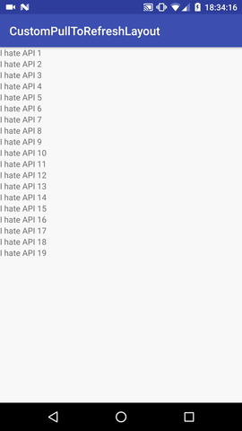

# Lottie Pull To Refresh Layout

A custom `SwipeRefreshLayout` that shows a [Lottie View](https://github.com/airbnb/lottie-android) instead.

</img>

## Basic usage

A `CustomPullToRefreshLayout` accepts only one child.
See example for more detail.

```xml
<?xml version="1.0" encoding="utf-8"?>
<be.rijckaert.tim.lib.CustomPullToRefreshLayout
    xmlns:android="http://schemas.android.com/apk/res/android"
    xmlns:app="http://schemas.android.com/apk/res-auto"
    android:id="@+id/pullToRefresh"
    android:layout_width="match_parent"
    android:layout_height="match_parent"
    app:lottieAnimation="pull_to_refresh.json">

    <android.support.v7.widget.RecyclerView
        android:id="@+id/recyclerView"
        android:layout_width="match_parent"
        android:layout_height="match_parent"/>

</be.rijckaert.tim.lib.CustomPullToRefreshLayout>
```

Custom Attributes include:

* `app:lottieAnimation="pull_to_refresh.json"` (Specify the animation to play)
* `app:lottieAnimationHeight="500"` (Tell the view how big it should be)
* `app:maxResetAnimationDuration="300"` (Specify how long the translation animation should take when snapping back to it's original state)

TODO:
* View State is not working for the moment
* Option to set startDelay() and other Lottie related properties
* Option to disable progressive pull-to-refresh
